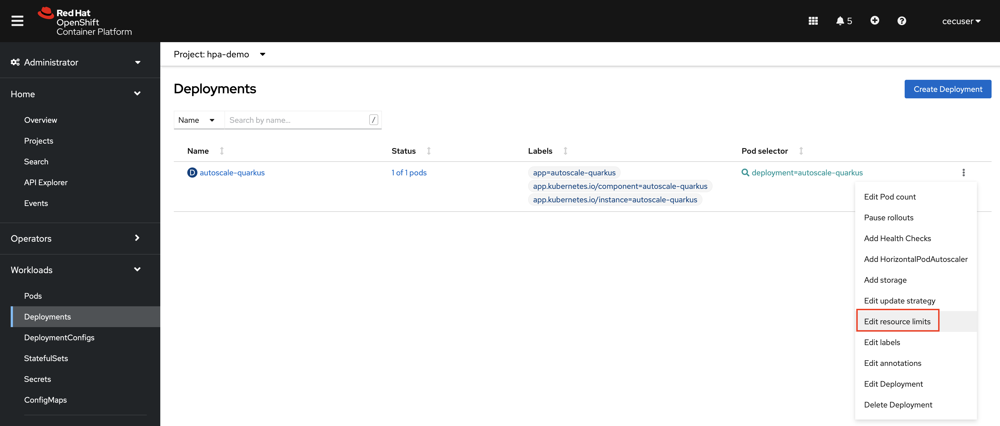
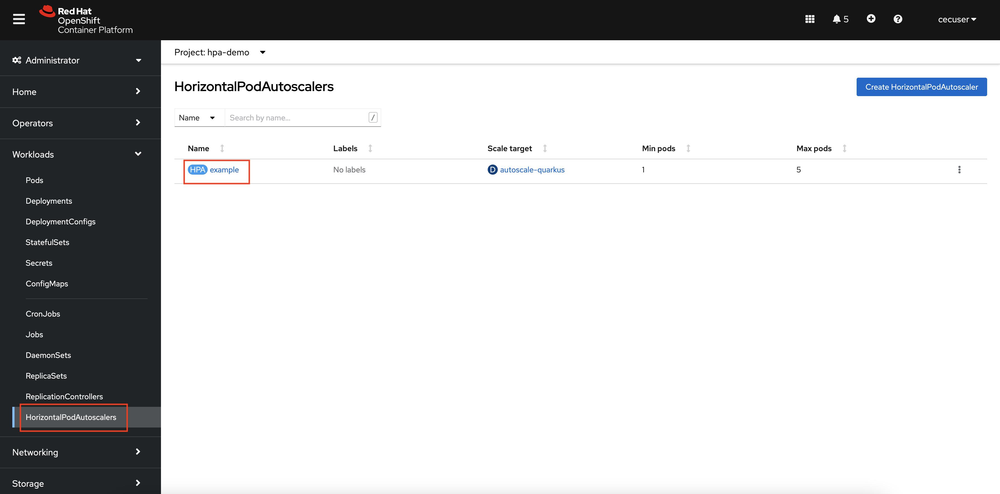
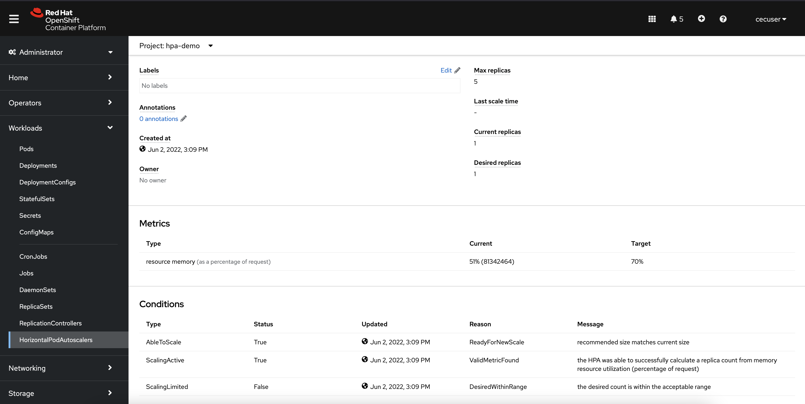

# OpenShift Pod Autoscaling on IBM Z and LinuxONE

## Table of Contents

- [OpenShift Pod Autoscaling on IBM Z and LinuxONE](#openshift-pod-autoscaling-on-ibm-z-and-linuxone)
  - [Table of Contents](#table-of-contents)
  - [Prerequisites](#prerequisites)
  - [Overview of Pod Autoscaling](#overview-of-pod-autoscaling)
  - [Horizontal Pod Autoscaling](#horizontal-pod-autoscaling)
  - [Vertical Pod Autoscaling](#vertical-pod-autoscaling)

## Prerequisites

1. OpenShift 4.10+ on IBM Z or LinuxONE
1. Cluster administrator privileges
1. Basic OpenShift knowledge including how to log into OpenShift through the web console and CLI, navigation and use of each.

## Overview of Pod Autoscaling
Scalability is one of the primary reasons the IT world is moving large portions of its workloads to Kubernetes and container platforms such as Red Hat OpenShift. Kubernetes' ability to rapidly scale containerized applications to suit user demand provides developers and cloud operators the flexibility to deploy an application without knowing exactly how many resources will be consumed or when they will be consumed. 

Two of the ways that Kubernetes provides rapid scalability are Horizontal Pod Autoscaling and Vertical Pod Autoscaling. 

**Horizontal Pod Autoscaling** automatically changes the *number of Pods* in a workload resource, such as a Deployment. When Kubernetes notices that there is an increased load on an application, it will automatically scale up up the number of Pods, and when the load decreases, it will automatically scale down the number of Pods.

**Vertical Pod Autoscaling**, on the other hand, will *automatically adjust the resource requests and limits* for a workload resource, such as a Deployment. Instead of scaling the number of Pods up or down, the number of Pods stays the same, but each is allowed to use more CPU or memory than originally set.

With OpenShift 4.10, both the Horizontal and Vertical Pod Autoscalers are now [supported on IBM zSystems and LinuxONE OpenShift clusters](https://docs.openshift.com/container-platform/4.10/release_notes/ocp-4-10-release-notes.html#ocp-4-10-ibm-z).

## Horizontal Pod Autoscaling
Operators and cloud administrators might be hesitant to give an OpenShift application free reign to scale its number of pods based on user demand. Imagine if a business critial application is suddenly hit with far more requests than normal due to an event like Black Friday shopping, a viral video that references a webpage, or a malicious DDOS attack. One can imagine thousands of pods being scaled up, surpassing the quantity that can be supported by the OpenShift cluster or the hardware it's running on. 

Fortunately, as you'll see in the rest of this section, the OpenShift (Kubernetes) Pod Autoscalers require certain parameters be set that avoid the possiblity of catastrophe, such as maximum/minimun number of Pods, resource limits, resource requests, and percentage of resource requests that prompts the Autoscaler to take action.

To get started with the demonstration, create an application on the OpenShift cluster that will be used to show the autoscaling functions. 

*Please note that all of the following steps can be completed either in the OpenShift web console or through the OpenShift command line. This demonstration will swap between the two methods.*

1. **Log into your OpenShift cluster using OpenShift command line.**

  You can find credentials and all necessary information from the *OpenShift on IBM Z - Bastion with Single Master Node* tile in your TechZone [My Reservations Page](https://techzone.ibm.com/my/reservations). Further details can be found within your *Project Kit*, which is linked on your reservation page.

1. Cr**eate a new project.**

  ```text
  oc new-project hpa-demo
  ```

1. **In the new project, deploy a pre-built Quarkus container image.**

  ```text
  oc new-app --image=quay.io/mmondics/autoscale-quarkus:v1 --name=autoscale-quarkus
  ```

  <details>
  <summary>Click to expand sample output</summary>

  ```text
  --> Found container image 2bc8c02 (11 hours old) from quay.io for "quay.io/mmondics/autoscale-quarkus:v1"

      Java Applications
      -----------------
      Platform for building and running plain Java applications (fat-jar and flat classpath)

      Tags: builder, java

      * An image stream tag will be created as "autoscale-quarkus:v1" that will track this image

  --> Creating resources ...
      imagestream.image.openshift.io "autoscale-quarkus" created
      deployment.apps "autoscale-quarkus" created
      service "autoscale-quarkus" created
  --> Success
      Application is not exposed. You can expose services to the outside world by executing one or more of the commands below:
      'oc expose service/autoscale-quarkus'
      Run 'oc status' to view your app.
  ```
  
  </details>

1. **Expose the Service to create a Route.**

  ```text
  oc expose service/autoscale-quarkus
  ```

  By default, you have one Quarkus Pod running in your project that is responsible for all requests that hit the application.

1. **Look at your one pod.**

  ```text
  oc get pods
  ```

  ```text
  NAME                                 READY   STATUS    RESTARTS   AGE
  autoscale-quarkus-597c7d55cb-jdplh   1/1     Running   0          74s
  ```

  Because there is only one replica of the Quarkus application running, it is solely responsible for all requests that come into the cluster through its exposed Route. Furthermore, because no resource requests or limits have been set for this application, it has the capability to use as many resources as it needs with no upper bound. This is clearly not a viable setup for production workloads or any situation where high availability and performance are needed. For this reason, setting resource requests and limits is considered a best practice. Furthermore, they are required for horizontal and vertical Pod autoscaling, so the next step is to set these for the Quarkus Deployment.

1. **Find your Pod's current memory usage.**

  ```text
  oc adm top pod
  ```

  ```text
  NAME                                 CPU(cores)   MEMORY(bytes)
  autoscale-quarkus-597c7d55cb-qkhxj   0m           68Mi
  ```

  In the example output above, the current memory utilization is 89 Mi. Your value will vary - take note of it for use in the next step.

1. **Navigate to your OpenShift web console and find your Quarkus Deployment.**

  Under the *Administrator* perspective, navigate to *Worklaods* -> *Deployments* and make sure you're in the *autoscaling-demo* project.

  
  
1. **Click on the three dots associated with the Quarkus Deployment, then click Edit resource limits.**

  

1. **Set the following resource requests and limits.**

  - CPU Request: 5 millicores
  - CPU Limit: 10 millicores
  - Memory Request: <DOUBLE_YOUR_CURRENT_USAGE> Mi
  - Memory Limit: <TRIPLE_YOUR_CURRENT_USAGE> Mi

  For example, because the current memory utilization of the Quarkus application when developing this demonstration was 68Mi, the Memory Request was set at 136 Mi and the Memory Limit was set at 204 Mi. 

  

  These requests and limits tell OpenShift that each Pod in the Quarkus Deployment is guaranteed access to 5 millicores of CPU and double your curent usage of memory. On the other hand, each Pod has a limit of 10 millicores CPU and triple your current usage of memory. This is a Java application that its much more memory-intensive compared to CPU, and was built with an endpoint we will hit to fill the memory even more. Therefore the CPU limits set in this step won't actually do anything or be acted upon during this demonstration.
  
  For more information about Kubernetes resource requests and limmits, you can read the documentation [here](https://kubernetes.io/docs/concepts/configuration/manage-resources-containers/). 

1. **Click Save for the changes to be applied to the Deployment and for a new Pod to spin up.**

  Next, you will need to create a HorizontalPodAutoscaler that defines the scaling boundries and triggers for autoscaling to occur.

1. **In the OpenShift web console, click the three dots associated with the Quarkus Deployment once again, then select Add HorizontalPodAutoscaler and fill in the fields with the following values.**
  
  - Minimum Replicas: 1
  - Maximum Replicas: 5
  - Target CPU Percent: 55%

  

  These parameters are telling OpenShift that the Quarkus application must have a minimum of 1 Pod, a maximum of 5 Pods, and to increase the Pod count whenever the CPU usage surpasses 55% of the CPU resource limit set in the above step (136 Mi). Therefore, whenever a Pod hits 75 Mi CPU usage ~(55% * 136 Mi), another Pod will be created.

  Note that a 55% memory utilization threshold is probably too low for a production workload and would likely trigger autoscaling very often. This number is being used for demonstration purposes only because we want to ensure autoscaling occurs. 

1. **Navigate to the HorizontalPodAutoscalers page in the OpenShift console, and click the HPA named `example` (unless you provided a different name).**

  

  On the page for your HPA, you can see information about the current and desired replica count, the current memory usage and the target of 55%, and messages about the conditions of the HPA. Unless something in your environment is vastly different than that of the environment used when developing this demonstration, you should only have 1 desired and current replica, and about 50% for current memory usage as a precentage of the request.

  

  In the next step, you will run a simple `for` loop that will run 100 iterations of a `curl` command against an endpoint built into the Quarkus application that uses the `fill()` method to add dummy data into memory. 
  
  <details>
  <summary>Click to see the code.</summary>

  ```java
  @GET
  @Path("fill/{index}")
  @Produces(MediaType.TEXT_PLAIN)
  public String fill(@PathParam("index") String index) throws Exception {

      HashMap<String, String> mem = new HashMap<String, String>();
      char[] chars = new char[2 * 1024 * 1024];
      Arrays.fill(chars, 'f');
      mem.put(Math.random() + "", new String(chars));
      System.out.println("Added " + index + "MB");
      return "Added " + index + "MB \n";
  }
  ```
  </details>

2. **From your command line terminal, set the hostname of your Quarkus application route as the variable `$QUARKUS_HOST`.**

  ```text
  QUARKUS_HOST=$(oc get route autoscale-quarkus -o=jsonpath='{.spec.host}')
  ``` 

1. **Annotate your Quarkus application route to use the round-robin load balancing algorithm.**

  ```text
  oc annotate route autoscale-quarkus haproxy.router.openshift.io/balance=roundrobin
  ```

  This will ensure that as new pods are created, requests are balanced evenly among them.

1. **Run the following command to add dummy data into memory. This command will take ~200 seconds to run - continue to the next step while it runs.**

  ```text
  for ((i = 1; i <= 100; i++ )); do curl http://$QUARKUS_HOST/hello/fill/$i ; sleep 2 ; done
  ```

  On your HorizontalPodAutoscalers page in the OpenShift console, you will start to see the current memory usage increase until it reaches the target (55%). Shortly after the threshold is met, a new Pod will be created.

  If your memory utilization is not reaching 55%, open another terminal session and run another instance of the above `for` loop concurrently. You can open as many sessions as you need to send enough requests.

1. **Once one or more new pods have been created, navigate to the Pods page in the OpenShift console.**

  

  Alternatively, you can run the command `oc get pods` in the CLI.

  ```text
  NAME                                 READY   STATUS              RESTARTS   AGE
  autoscale-quarkus-5b6b645f64-22s7c   1/1     Running             0          22s
  autoscale-quarkus-5b6b645f64-5ccnd   1/1     Running             0          53m
  autoscale-quarkus-5b6b645f64-8mxvj   1/1     ContainerCreating   0          22s
  autoscale-quarkus-5b6b645f64-ckvbz   0/1     Running             0          7s
  autoscale-quarkus-5b6b645f64-wmcvm   1/1     Running             0          22s
  ```

The HorizontalPodAutoscaler object created in the hpa-demo project can be modified with more parameters to customize the behavior of the autoscaling. For example, Scaling Policies can be used to control the rate at which the pods scale up or down by setting a specific number or specific percentage to scale in a specified period of time. Further configuration is outside the scope of this demo, but you can read more about HPA customization in the OpenShift documentation [here](https://docs.openshift.com/container-platform/4.10/nodes/pods/nodes-pods-autoscaling.html#nodes-pods-autoscaling-best-practices-hpa_nodes-pods-autoscaling).

## Vertical Pod Autoscaling
